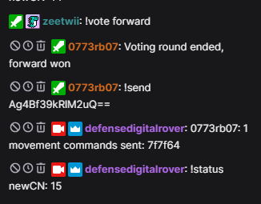
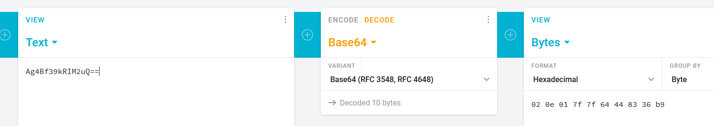

# Defense Digital Rover Walkthrough

This guide provides step by step instructions on how to use and solve each of the different ways to control the rover.  

## Vote and Send

It may seem like a joke to have the voting system in the game, but its actually the main method to collect sample data that will allow you to reverse engineer the send command.  

|   |
:-:
|  | 
| An example from a voting round, where the output is a forward command |

There are three key messages in the screenshot above: the send command from otterbot, the response from the rover, and the status command from the rover.  The send command is transmitting some form of encoded data, while the response message seems to be decoding and broadcasting what was transmitted.  The status message is updating a counter with each transmission.  These three messages tell us everything we need to reverse how the command works and generate our own message.  

### Reversing the send command

The first goal is to figure out what data was actually transmitted to the rover.  You may recognize it right away due to the `==` at the end, or you may have to play around with things, but you should eventually be able to figure out that the send command transmits using the base64 encoding.  This means we can decode the message by using something like the `binascii` package in python or using a website like [this](https://cryptii.com/pipes/base64-to-hex).  For this example, we'll use the website.  

|   |
:-:
|  | 
| Decoding the base64 message |

After decoding the base64 message, we're left with the hex data of: `02 0e 01 7f 7f 64 44 83 36 b9`.  Now we can begin identifying message fields.  

#### Movement Command

We know from the rover's response that this message contains one movement command of `7f7f64`.  Sure enough, the four middle bytes match that data with `01 7f 7f 64`.  This means that the third byte in the message is likely a counter for the number of movement commands, and the three bytes afterwords are the given command.  But what do those bytes mean?  This is where it is important to capture multiple messages that have the rover move in different directions.  Doing so will show the following pattern:

* The voting messages always contain only a single movement command
* The first two bytes in the movement command change depending on which direction the rover is moving
* The first two bytes alternate between the decimal values of 127 and 255
* the last byte in the movement command is always the same
* the rover will always move for roughly one second on screen after a voting round

Using these data points, we can figure out how the movement command works.  Lets start with the motors first.  By comparing motor movements to commands, one can figure out that `7f` or 127 is forward, and `ff` or 255 is reverse.  This also means that the MSB in the byte is acting a sign bit to tell the motor which direction to turn, and that both 0 and 128 will mean stop.  At this point we can figure out that the first byte is the left motor and the second is the right motor.  But what does the last byte mean in the movement message?

Recall how the rover always seems to run for only a single second, and that based on the logic of how a DC motor works, each movement command must pass both motors three things: direction, power, and run duration.  We already solved for direction and power, which means this last value must be time.  `64` in hex is equal to 100 in decimal, and multiply that by 10 and you have 1000.  1000 milliseconds is the same as one second, which is conveniently the run duration of the rover when executing this movement command.  We can validate this assumption later on, but for now just trust me that the time field of the movement command is in 10s of miliseconds, which gives a max run time for any one movement commad to be 2.55 seconds.  

With the movement command solved, its time to move out and identify some of the other message fields.  

#### Command Number

The first byte to the left of the movement command is `0e` which is 14 in decimal.  The status message says that the next command number is 15, which means this message had to have been 14.  Given that this is the only byte with a value of 14, it must be the command number.  

#### Static header

The first byte in the message is always static, and it is the only static field in the message.  This means that it is likely some primary identifer given that it is also the first byte of the message,  You can test this on your own, but you should get an error from the rover, where it will yell at you for using the wrong header.  In this case, the header identifies the type of command we will be transmitting to the rover, movement commands in this case.  

#### CRC

Identifying a checksum from scratch is a slow process.  Thankfully there are different web tools that let you try out different data combinations to generate different checksums.  Using [this site](https://crccalc.com/), we can plug in the message fields that we have identified and generate some CRCs to compare to the remaining data.  Using this, we can identify the last four bytes of the message as a CRC32 checksum.  