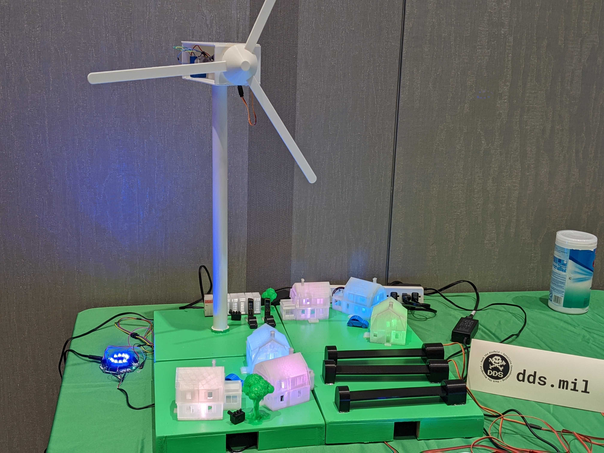
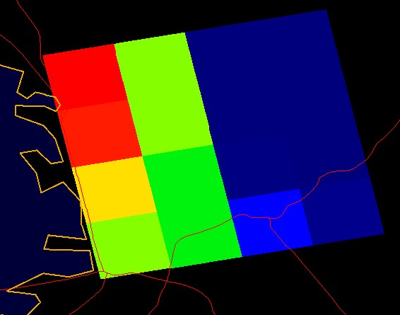
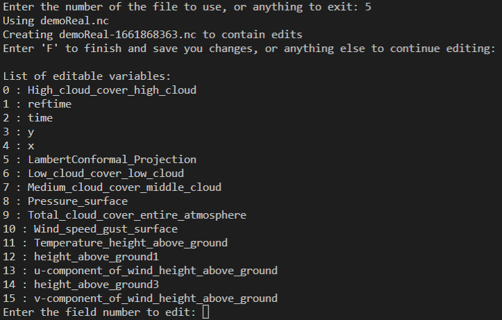
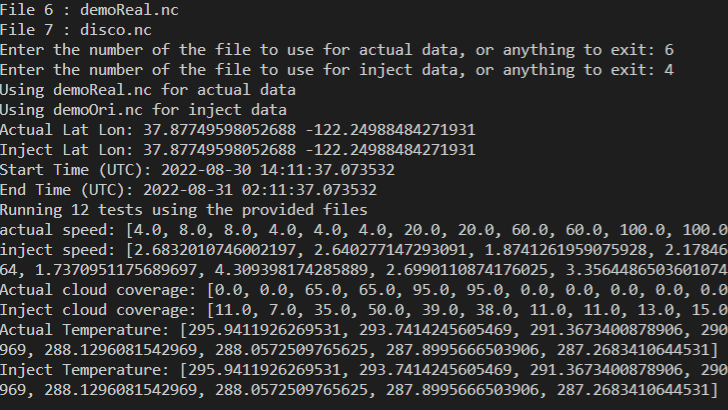
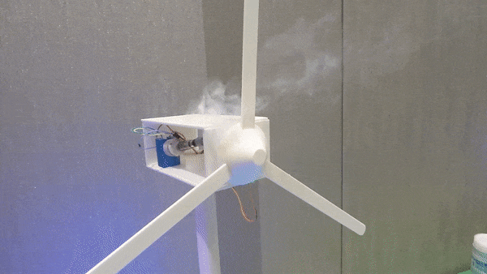

# Hack The Microgrid

Welcome to the Hack the Microgrid workshop page.  This workshop was developed in partnership with the US Amry Fort Hunter Liggett and Lawrence Berkeley National Labs.  The goal is to show off how new advancements in microgrid design have also changed how the cyber security of these grids need to be thought about.  And while it's true that the biggest threat to power grids is still the grey squirrel, there are sadly no grey squirrel conferences, thus we're here instead.  

## Background

Microgrids, like there name implies are basically small power grids, meant to provide backup power in case of power outages to a small area of buildings relatively close together.  While a large power grid will cover multiple states and cities, microgrids tend to be more for neighborhood size spaces.  Think of them as a step up from the solar panels that people install on their roofs.  Because microgrids cover a larger area, they can have larger generation sources than what one might find on their personal home.  This can be everything from big diesel generators, to large solar farms, and everything in between.  

Most modern microgrids have started implementing advance management software that allows it to do things like time when it sells power back to the main grid, or to control how it shuts off systems when it runs out of power.  These features allow the owners of the microgrid to maximize their return on investment, and to ensure that even if the grid does run out of power, that essential systems stay on as long as possible.  However all these new capabilities have also changed what the attack surface of a microgrid looks like, which isn't something that the community at large has kept up with.  

## Game
| |
| --- |
| The point of the game is to demonstrate a unique vulnerability that some microgrids have when an adversary injects malicious weather data.  To do this, the player will manipulate HRRR weather forecasts. These forecasts are basically giant arrays with each region represented as sectors on a map.  You can either download these files manually from different sources, or use our [helper script](./code/hrrMod/sourceGrabber.py) to grab some for you.  |
|  |
| To edit these files, we've provided an [editor script](./code/hrrMod/editor.py), although you can just as easily make your own using any netcdf4 library.  |
|  |
| After editing the files, you can use the [game script](./code/hrrMod/microGame.py) to play the game by selecting a real and inject file to run through the simulation.  The reason we give the system two files is that your not actually editing the weather, only what the system thinks the weather is.  This way you the player can make scenarios where a storm is coming, but the system thinks things are fine, or cases where the system overreacts when there is no bad weather.  |
|  |
| After playing the game a few times, you'll notice that the house lights change colors, and the turbine will change speed based off of the different fields that you edit.  Due to time constraints, only three fields are used in the game: Total cloud coverage (controls the solar setup), wind speed gust (controls the turbine), and temperature (controls the three easter eggs). Should you be able to shut down everything, you;ll get a little fire to go with your light show.  |
|  |

## DIY

To make your own version of this microgrid, check out our parts list and build guide [here](./stl/README.md)