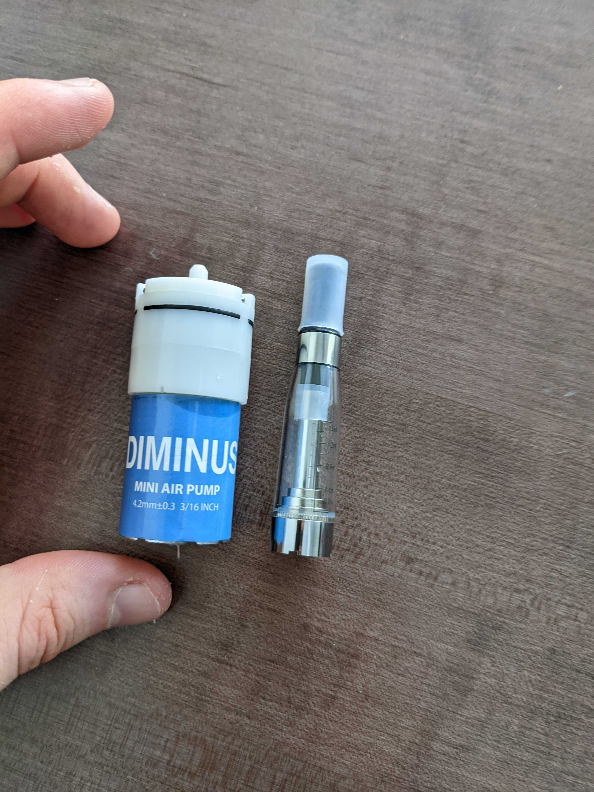
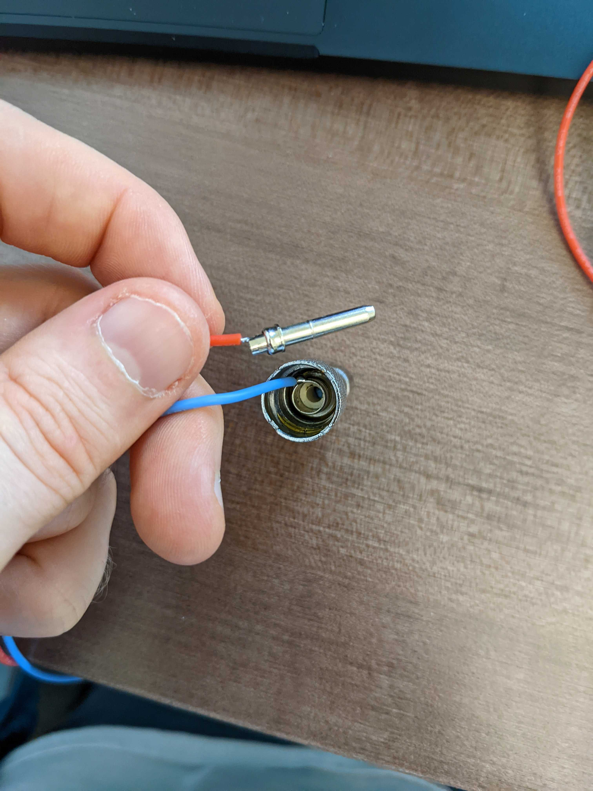
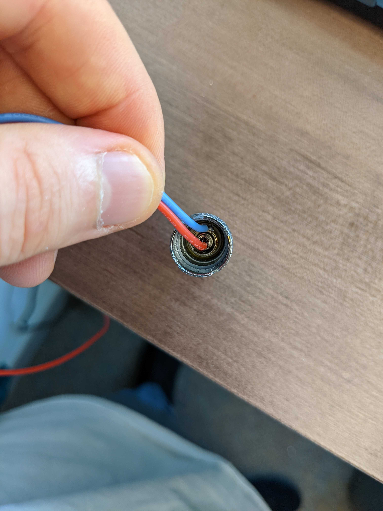
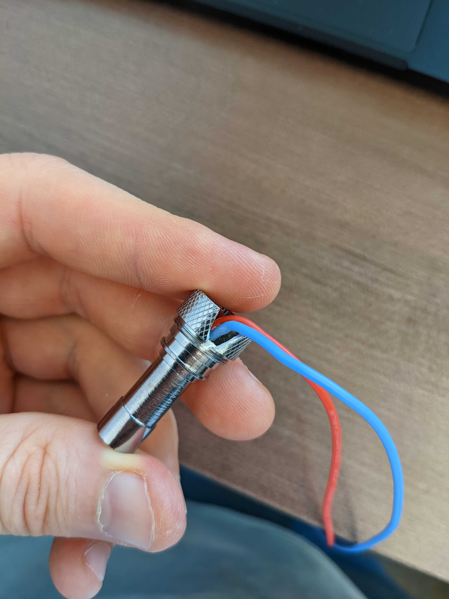
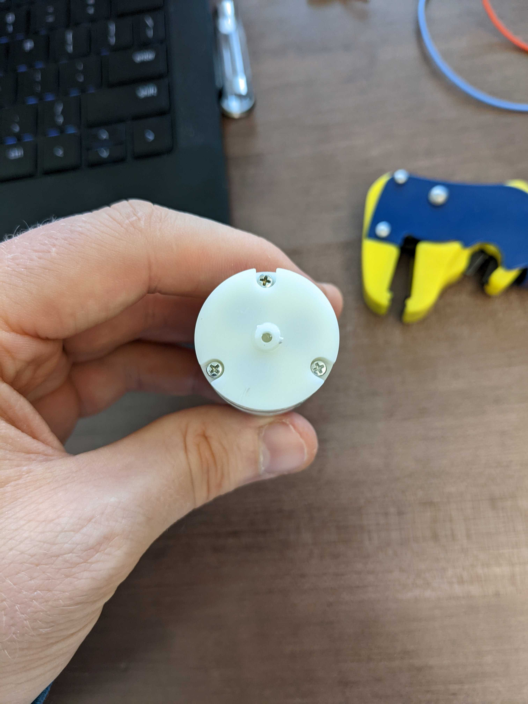
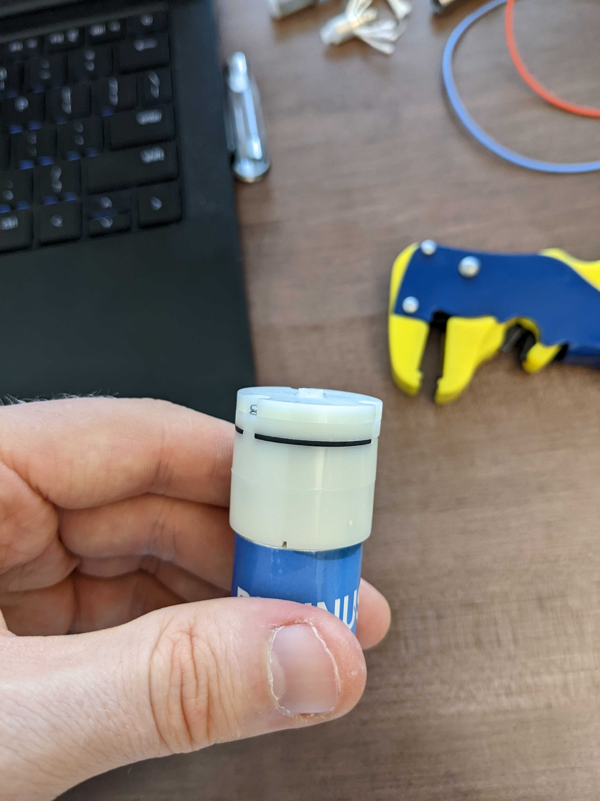

# STL Files

This si a list of files to print to make your own microgrid

## Print Instructions

All the pieces were broken up in such a way that you should be able to print everything without needing supports on a 3D printer.  The prints were all designed for printing on a FDM printer, however they might work on an SLA printer, assuming your print bed is large enough.  

### Houses

These are all based off of a [model that we pulled from Thingiverse](https://www.thingiverse.com/thing:31644) and edited to have a hole for the neopixel LEDs.  

There are six houses in the setup, one for each LED on the neopixel cables we made.  They were printed in [natural color PLA](https://www.matterhackers.com/store/3d-printer-filament/175mm-pla-filament-natural-1-kg) to give them a semitransparent effect.  

Each house requires one of each:
- [First Floor](./house/The_Puritan_1st_floor_hole.stl)
- [Second Foor](./house/The_Puritan_2ed_floor_hole.stl)
- [Roof](./house/The_Puritan_Roof.stl)

## Build Instructions

### Smoke Machine

This year has a new smoke machine, using a [CE5 clearomizer](https://www.centralvapors.com/ce5-clearomizer/) as the heating element.  This has the advantage of simplifying the build process, because the vaporization chamber can be disassembled, making it easier to solder everything, and also less likely that things will leak.  

To build the smoke machine, you need two things:
* [CE5 clearomizer](https://www.centralvapors.com/ce5-clearomizer/) as the heating element
* Electronic Air Pump
  * [Example 6V option](https://www.amazon.com/DIMINUS-Replacement-Accessories-Aquarium-Circulate/dp/B06Y2CXZ67/)
  * [Example 3V option](https://www.amazon.com/Mini-Oxygenation-Increasing-Oxygen-Aquarium/dp/B00O1AOPX8)

| Build Steps |
| --- |
|  |
| While you can technically use any vaporization chamber and air pump for this, the following instructions assume that you are using either the hardware shown above or something similar.  |
|  | 
| Disassembly of the clearomizer will make this process easy, however not all valorization chambers can be disassembled.  |
|The innermost pin needs to be tied to high, while the inner cover needs to be tied to negative.  26 or 28 AWG wire is recommended.  The wires in the photo are 28 AWG with the red wire soldered to the inside of the pin, and the blue wire soldered to the battery connector.  | 
|  |
| Placing the pin back into the heating element should get you something that looks similar to this.  Note that even though the hot wire is soldered to the inside of the pin, there is still space for air to flow through, and the inner hole is not clogged.  |
|  |
| These next couple steps will require a dremel or similar cutting tool.  Using the dremel, cut a notch into the outer aluminum shell, this is to route the wires ouside the vape chamber while still keeping things flush with the air pump. |
|  |
| The next thing to modify is the air pump.  Your air pump likely has a small nozzle on the top, like in the photo above.  We will be cutting some of this off, so that the pump and vaporization chamber can just be glued together.  |
|  |
| You don't need to cut off the entire nozzle, just enough so that the vape chamber can easily sit on top of it.  |
|  |
| To hold the two pieces together, just use hotglue along the edge of the vape chamber to attach it to the top of the air pump.  Don't forget to use hot glue to cover the outside of the notch you cut, that way air still gets pushed through the vaporizer.  |

- To hold the smoke machine in the turbine, use: [this as a mounting base](./turbine/prop-smokeHolder.stl)
- To push smoke out of the turbine, use some silicone hosing with a 4mm ID and 6mm OD, [this for example](https://www.amazon.com/uxcell-Silicone-Flexible-Translucent-Transfer/dp/B01N63VFI3)
- To get the hose to fit onto the smoke machine top, use [this cap cover](./turbine/prop-smokeCap.stl)
- To make the smoke, fill the vaporization chamber with any commercial fog juice before running.  Any glycerin based solution will work.  