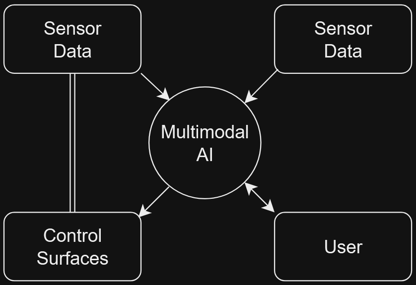
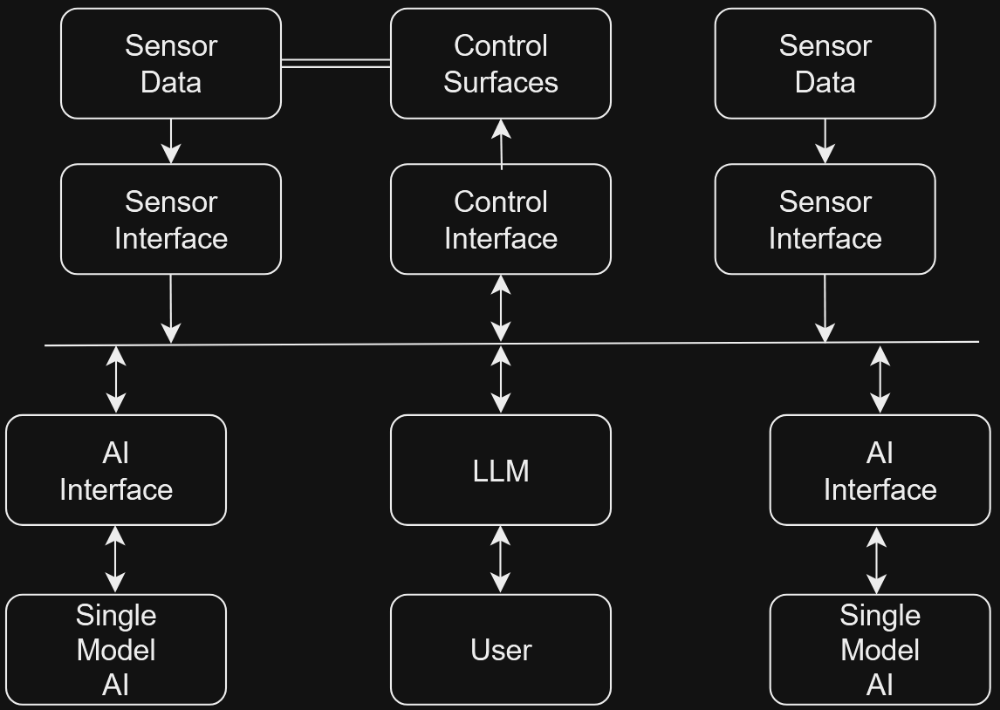

# Modal Madness

Modal Madness is our workshop for DEFCON32.  One of the big trends this year has been trying to use generative AI models with more physical systems, and with multimodal models becoming more common, it makes a lot of sense.  However, how you implement said model or models on your platform changes how easy it is to exploit or break your system, as well as the nature of the vulnerabilities you need to try and protect against.  

## Background and Terms

In AI terms, a modal model is a model that is able to process a single type of data.  The classic example of this is a computer vision model, like YOLO.  These models can process images and videos, and do things like object recognition, but they can only process visual data, nothing else.  Thus, a multimodal model is a model that can process and respond to multiple types of data.  One of the most well known multimodal is OpenAIs ChatGPT 4.o models, which are combined text and vision models.  

Hallucinations are a thing that all generative AI models do, it's the short hand name for any and all unwanted creativity from the system.  Because LLMs and other generative AI systems can be simplified down as probability engines, they don't have any concept of truth or correctness.  This can be seen in examples like you ask an LLM to write a poem about birds, but the one it generates is for bees.  

You would be forgiven for thinking that if you have a model that can process all the data sets you want to use at once, that it must be the best model to use.  And it is by far the simplest and most optimized from a design perspective, just make the multimodal model the core of your program, pass everything to it, and let it figure things out on its own.  However this simple design has a major problem: If any part of the model hallucinates or messes up for any reason, you have no easy way to detect, contain, or fix this since the problem is literally at the core of your program.  

An alterative design is to do a multi-model design, where you have multiple individual AI models that each do their own thing independently of each other, but are able to pass data back and forth.  These multi-model systems are much more complicated to design, but since each model is stand  alone, you can check the input and data going in and out of each one, allowing you to detect and react to hallucinations and other unwanted creativity.  

This is all a lot of text, so lets use a flow diagram to visualize what we are talking about.  Lets assume you have a physical system, maybe a robot of some kind.  This system has two sensors on it, one of which changes values based on the status of the control surfaces of the system, while the other is completely independent.  We're going to make two versions of adding an AI to this system.  One with a multimodal model, and one with a multi-model implementation.  Lets look at what these look like:

| Multimodal vs Multi-Model |
| --- |
|  |
| This is what the solution looks like when tying everything directly to a multimodal AI.  You can see it's very simple and optimized from a design perspective.  However if and when the AI does something you don't want, your very limited in both becoming aware of the problem or reacting to it, since if the multimodal AI goes bad, there's no real way for the system to become aware of this.  |
|  |
| This is the same system, but using several standalone AI models to mimic a single multimodal one.  Notice how none of the AIs connect to any of the systems directly, they're all going through an interface of some kind for each sensor and system, including each other.  These interfaces are acting as API calls for the underlying sensor or system.  This has the advantage of black boxing each of the AIs, allowing you to change them out without having to retrain the system.  Additionally it means that you can detect things like hallucinations by using the same methods you would use for any normal input validation from a user.  This method has a lot of long term advantages for the system, but as the image shows is far more complicated to initially code.  |

## The Game

We have two robots, one Black and the other Green.  Black is running a multi-model framework, specifically [this one that we built for this workshop](https://github.com/zeetwii/combee).  The green robot will be running a true multimodal implementation with everything and every command getting passed directly to and straight from the model.  Additionally, both systems will be running OpenAI's whisper code to do both speech to text and text to speech.  You the player will talk to the robots via onboard microphones, and they will intern talk back via onboard speakers.  Your mission is to try to get them to break and go crazy, and see how the different implementations will cause the same prompt to be processed and reacted to differently.  Both robots will be using OpenAI 4.o model, however Black will only be using it as an LLM, and instead be using YOLOv10 as the computer vision model.   

Winners will get magnetic buttons, since stickers have been forsaken by the powers that be.  